[

](https://pypi.python.org/pypi/hstrat)
[

](https://codecov.io/gh/mmore500/hstrat)
[

](https://www.codacy.com/gh/mmore500/hstrat/dashboard)
[

](https://github.com/mmore500/hstrat/actions)
[

](https://hstrat.readthedocs.io/en/latest/?badge=latest)
[
](https://github.com/mmore500/hstrat)
[

](https://zenodo.org/badge/latestdoi/464531144)
[](https://doi.org/10.21105/joss.04866)

hstrat enables phylogenetic inference on distributed digital evolution populations

- Free software: MIT license
- Documentation: <https://hstrat.readthedocs.io>

## Install

`python3 -m pip install hstrat`

## Usage

```python3
from hstrat import hstrat

print("creating founder1 and founder2, which share no ancestry...")
founder1 = hstrat.HereditaryStratigraphicColumn(
    # retain strata from every generation
    stratum_retention_policy=hstrat.fixed_resolution_algo.Policy(1)
)
founder2 = hstrat.HereditaryStratigraphicColumn(
    # retain strata from every third generation
    stratum_retention_policy=hstrat.fixed_resolution_algo.Policy(3),
)

print(
    "   do founder1 and founder2 share any common ancestor?",
    hstrat.does_have_any_common_ancestor(founder1, founder2)
) # -> False

print("creating descendant2a, 10 generations removed from founder2...")
descendant2a = founder2.Clone()
for __ in range(10): descendant2a.DepositStratum()

print(
    "   do founder2 and descendant2a share any common ancestor?",
    hstrat.does_have_any_common_ancestor(founder2, descendant2a)
) # -> True

print("creating descendant2b, 20 generations removed from descendant2a...")
descendant2b = descendant2a.Clone()
for __ in range(20): descendant2b.DepositStratum()

print("creating descendant2c, 5 generations removed from descendant2a...")
descendant2c = descendant2a.Clone()
for __ in range(5): descendant2c.DepositStratum()

# note MRCA estimate uncertainty, caused by sparse stratum retention policy
print(
    "   estimate descendant2b generations since MRCA with descendant2c?",
    hstrat.calc_ranks_since_mrca_bounds_with(
      descendant2b,
      descendant2c,
      prior="arbitrary",
    ),
) # -> (19, 22)
print(
    "   estimate descendant2c generations since MRCA with descendant2b?",
    hstrat.calc_ranks_since_mrca_bounds_with(
      descendant2c,
      descendant2b,
      prior="arbitrary",
    ),
) # -> (4, 7)
print(
    "   estimate generation of MRCA between descendant2b and descendant2c?",
    hstrat.calc_rank_of_mrca_bounds_between(
      descendant2b, descendant2c, prior="arbitrary"
    ),
) # -> (9, 12)
```

As shown in the example above, all library components can be accessed directly from the convenience flat namespace `hstrat.hstrat`.

See `examples/` for more usage examples, including

* incorporation of hstrat annotations into a custom genome class,
* automatic stratum retention policy parameterization,
* pairwise and population-level phylogenetic inference, and
* phylogenetic tree reconstruction.

## How it Works

The goal of this software is to enable approximate inference of the phylogenetic history of a distributed digital population solely through analysis of heritable genome annotations.
Put another way, given a scenario where packets of data are being copied and moved within a distributed system, this software enables estimation of how closely any two data packets are related.
More precisely, for any two extant data packets, estimation bounds can be produced for the number of copies elapsed from those packets' last shared source copy (i.e., most recent common ancestor a.k.a. MRCA) to yield each extant packet.
This is done by means of annotations on the data being copied itself --- no centralized tracking system required.

This capability has direct applications in digital evolution research (e.g., artificial life, genetic programming, genetic algorithms), and also may prove useful for other distributed systems applications.


A simple heritable annotation to enable relatedness estimation would be a bitstring under neutral drift.
Under this model, the number of generations elapsed since two bitstrings' MRCA would be inferred from the number of mismatching sites --- more mismatching sites would imply less relatedness.
An example scenario is shown above.

This model suffers from several serious drawbacks in application as a tool for relatedness estimation, including difficulty discerning uneven elapse of generations since MRCA and difficulty parameterizing the model for effective inference over greatly varying generational scales.


Instead, we use randomly-generated binary "fingerprints" as a record of shared ancestry at a particular generation.

An example scenario is shown above.
Each generation, a new randomly-generated "fingerprint" (drawn as a solid-colored rectangle above) is appended to the genome annotation.
Genomes' annotations will share identical fingerprints for the generations they experienced shared ancestry.
Estimation of the MRCA generation is straightforward: the first mismatching fingerprints denote the end of common ancestry.

Internally, we refer to these "fingerprints" as _differentia_.
The bit width of differentiae controls the probability of spurious collision events (where strata happen to share the same randomly-generated value by chance), and is tunable by the end user.

In analogy to geological layering, we refer to the data deposited each generation (differentia and optional user-defined arbitrary annotations) as a _stratum_.
We call the annotation comprised of strata deposited at each generation a _hereditary stratigraphic column_.
In accordance, we describe this general approach for relatedness estimation _hereditary stratigraphy_.


As stated so far, hereditary stratigraphy suffers from a major pitfall: linear space complexity of the annotation with respect to the number of generations elapsed.
This means that time required to copy and transmit annotations, as well as memory requirements to store those annotations, will grow rapidly and without bound.

Systematically pruning strata --- deleting data from certain generations from the annotation as generations elapse --- can reduce space complexity.
However, pruning introduces uncertainty to MRCA generation estimates.
The exact last generation of common ancestry is bounded between the last-matching and first-mismatching strata, but cannot be resolved within that window.

In this way, hereditary stratigraphy exposes a direct, well-delimited, and flexible trade-off between space complexity and estimation accuracy.
A pruning strategy must specify the set of strata to be pruned at each generational step.
We call the particular sequence of strata sets pruned at each generation a _stratum retention policy_.


The most obvious consideration with respect to stratum retention policy is the number of strata to prune.
If, on average, one stratum is pruned for each added then a constant `O(1)` space complexity will be achieved.
On the other hand, pruning no strata or pruning every other, every third, etc. strata will yield a linear `O(n)` space complexity.
Intermediate space complexities, such as `O(log(n))`, can also be achieved.


Another, more subtle, stratum retention policy consideration is _where_ to prune.
An obvious choice might be to prune uniformly, yielding evenly-spaced retained strata.
However, pruning may also be performed to distribute retained strata so that estimation windows provide fixed relative error rather than absolute error.
That is, error in MRCA generation estimation would be proportional to the number of generations elapsed since the true MRCA generation.
Such a strategy exchanges lower absolute error in estimating more recent MRCA events for higher absolute error in estimating more ancient MRCA events.
The cartoon above contrasts retained strata under even and recency-proportional pruning.

Requirements on acceptable space-vs-resolution and distribution-of-resolution trade-offs will vary fundamentally between use cases.
So, the `hstrat` software accommodates modular, interchangeable specification of stratum retention policy.
We provide a library of predefined "stratum retention algorithms," summarized below.
However, end users can also use custom stratum retention algorithms defined within their own codebases outside the library, if needed.
(Any custom algorithms with general appeal are welcome to be contributed back to the `hstrat` library!)

More detail on the rationale, implementation details, and performance guarantees of hereditary stratigraphy can be found in [(Moreno et al., 2022)](#moreno2022genome).

## Available Stratum Retention Algorithms

The space-vs-resolution and distribution-of-resolution trade-offs of library-provided stratum retention algorithms are summarized below.

| Stratum Retention Algorithm               | Space Complexity | MRCA Gen Uncertainty |
| ----------------------------------------- | ---------------- | -------------------- |
| Fixed Resolution Algorithm                | `n/k`            | `k`                  |
| Recency-proportional Resolution Algorithm | `k * log(n)`     | `m/k`                |
| Depth-proportional Resolution Algorithm   | `k`              | `n/k`                |
| Geometric Sequence Nth Root Algorithm     | `k`              | `m * n^(1/k)`        |
| Curbed Recency-proportional Resolution Algorithm | `k`     | `m / k` -> `m * n^(1/k)` |

where `n` is generations elapsed, `m` is generations since MRCA, and `k` is an arbitrary user-determined constant.

Note that distribution-of-resolution trade-offs are described via the definition of uncertainty bounds in terms of generations since MRCA `m` versus overall generations elapsed `n`.

The `hstrat` library includes a suite of variants for several of these stratum retention algorithms.
These variants differ in terms of secondary considerations, for example whether column size exactly traces the asymptotic guarantee or fluctuates around it.
Computational intensity to calculate the set of strata to be dropped at each generation may also differ between variants.

The next sections tour available stratum retention algorithms in detail.

### Retention Drip Plot Visualization

| No History                                                                                                                                                                                                                                                                                                                                                                                                                                                         | Retained History                                                                                                                                                                                                                                                                                                                                                                                                                                                  | All History                                                                                                                                                                                                                                                                                                                                                                                                                                                       |
| ------------------------------------------------------------------------------------------------------------------------------------------------------------------------------------------------------------------------------------------------------------------------------------------------------------------------------------------------------------------------------------------------------------------------------------------------------------------ | ----------------------------------------------------------------------------------------------------------------------------------------------------------------------------------------------------------------------------------------------------------------------------------------------------------------------------------------------------------------------------------------------------------------------------------------------------------------- | ----------------------------------------------------------------------------------------------------------------------------------------------------------------------------------------------------------------------------------------------------------------------------------------------------------------------------------------------------------------------------------------------------------------------------------------------------------------- |
| [](docs/assets/a=stratum_retention_dripplot+extant_history=False+extinct_history=False+extinct_placeholders=True+num_generations=256+policy=tapered-depth-proportional-resolution-stratum-retention-algorithm-resolution-4+ext=.gif) | [](docs/assets/a=stratum_retention_dripplot+extant_history=True+extinct_history=False+extinct_placeholders=True+num_generations=256+policy=tapered-depth-proportional-resolution-stratum-retention-algorithm-resolution-4+ext=.gif) | [](docs/assets/a=stratum_retention_dripplot+extant_history=True+extinct_history=True+extinct_placeholders=False+num_generations=256+policy=tapered-depth-proportional-resolution-stratum-retention-algorithm-resolution-4+ext=.gif) |

Because stratum retention policies unfold across space and time (i.e., the location of pruned strata and the generations at which they are pruned), the retention drip plot visualizations we use to depict them require a bit of explanation to get up to speed with.
This section builds up the visualizations step-by-step in the table above.
(Note that the animations loop at 256 generations; if you are impatient you can refresh the page to restart the animations.)

The leftmost column animates the evolution of a single hereditary stratigraphic column over generations with no historical overlay.
The column itself is shown "tipped over," appearing as a horizontal blue rectangle.
Upside-down triangles are stratum within the column.
The position of strata in the `x` dimension correspond to the generation of their deposition; new strata are appended on the right.
Retention status is depicted with color.
Black strata are retained and red strata have been pruned.

The center column uses the `y` dimension to introduce historical traces for retained strata.
The line below each retained stratum spans from the generation it was deposited to the current generation.
Note that the column itself is positioned at the current generation at the top of the diagram.

Finally, the rightmost column further layers on historical traces of pruned strata.
Instead of having their trace deleted when pruned, their trace is turned red and frozen in place.
So, red traces span from the generation a pruned stratum was deposited to the generation it was pruned.

Animated panels below situate this visualization alongside additional graphs depicting absolute and relative estimation error across possible MRCA generations as well as relative and absolute column size (i.e., number of strata retained).
Two policy instantiations are visualized for each algorithm --- one yielded from a sparse parameterization and the other from a dense parameterization (i.e., one configured to retain fewer strata and one configured to retain more).

### Depth Proportional Resolution Algorithm

The depth proportional resolution algorithm drops half of retained strata when a threshold size cap is met in order to maintain `O(1)` space complexity.
Retained strata are evenly spaced.

| Sparse Parameterization                                                                                                                                                                                                                                                                                                | Dense Parameterization                                                                                                                                                                                                                                                                                                 |
| ---------------------------------------------------------------------------------------------------------------------------------------------------------------------------------------------------------------------------------------------------------------------------------------------------------------------- | ---------------------------------------------------------------------------------------------------------------------------------------------------------------------------------------------------------------------------------------------------------------------------------------------------------------------- |
| [](docs/assets/a=policy_panel_plot+num_generations=256+policy=depth-proportional-resolution-stratum-retention-algorithm-resolution-2+ext=.gif)            | [](docs/assets/a=policy_panel_plot+num_generations=256+policy=depth-proportional-resolution-stratum-retention-algorithm-resolution-8+ext=.gif)            |
| [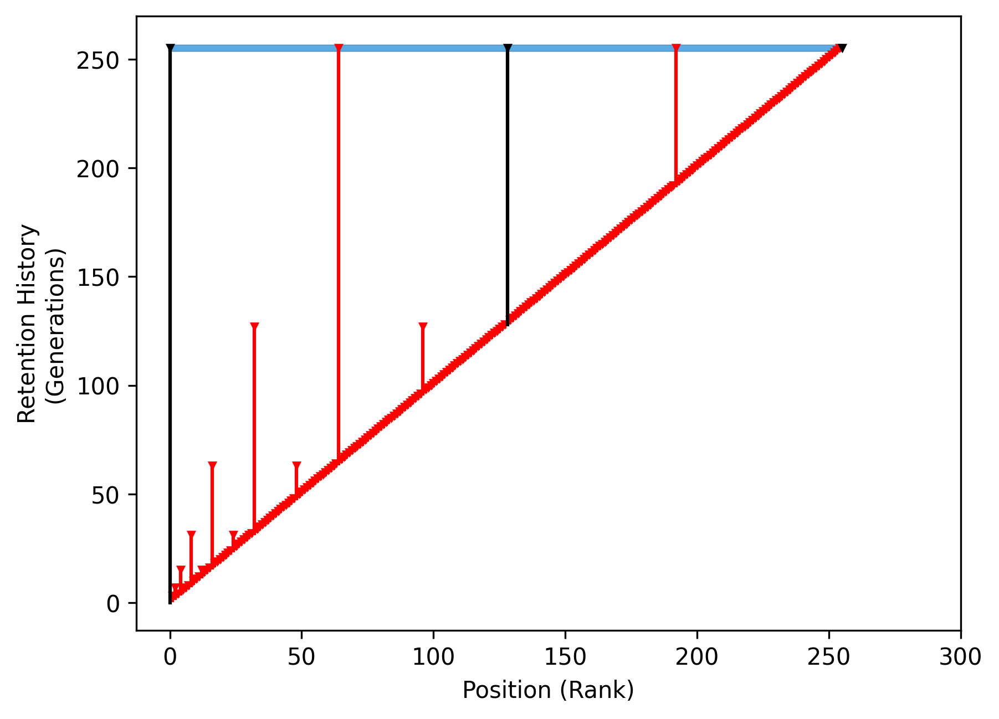](docs/assets/num_generations=256+policy=depth-proportional-resolution-stratum-retention-algorithm-resolution-2+viz=stratum-retention-dripplot+ext=.png) | [](docs/assets/num_generations=256+policy=depth-proportional-resolution-stratum-retention-algorithm-resolution-8+viz=stratum-retention-dripplot+ext=.png) |

#### Dense Parameterization Detail
| Num Strata Retained                                                                                                                                                                                                                                                                                            | Absolute MRCA Uncertainty by Position                                                                                                                                                                                                                                                                                                                              | Relative MRCA Uncertainty by Position                                                                                                                                                                                                                                                                                         |
| ------------------------------------------------------------------------------------------------------------------------------------------------------------------------------------------------------------------------------------------------------------------------------------------------------------------------ | ----------------------------------------------------------------------------------------------------------------------------------------------------------------------------------------------------------------------------------------------------------------------------------------------------------------------------- | ----------------------------------------------------------------------------------------------------------------------------------------------------------------------------------------------------------------------------------------------------------------------------------------------------------------------------- |
| [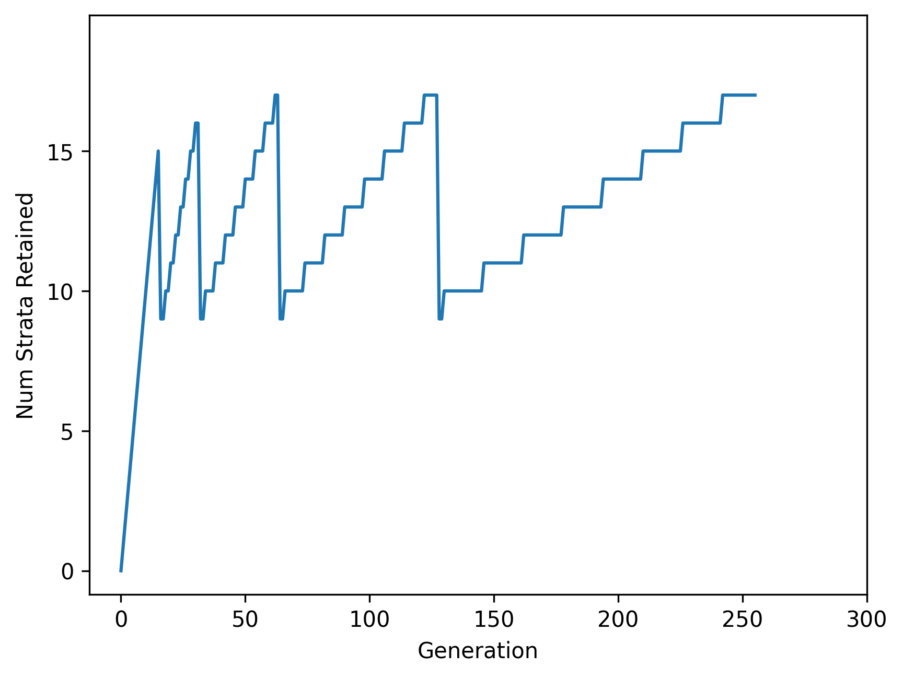](docs/assets/num_generations=256+policy=depth-proportional-resolution-stratum-retention-algorithm-resolution-8+viz=strata-retained-num-lineplot+ext=.png) | [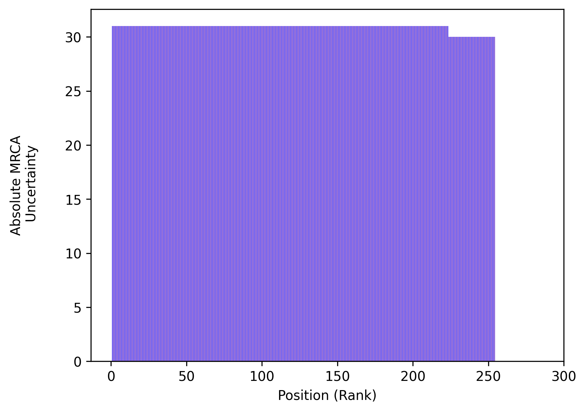](docs/assets/num_generations=256+policy=depth-proportional-resolution-stratum-retention-algorithm-resolution-8+viz=mrca-uncertainty-absolute-barplot+ext=.png) | [](docs/assets/num_generations=256+policy=depth-proportional-resolution-stratum-retention-algorithm-resolution-8+viz=mrca-uncertainty-relative-barplot+ext=.png) |

### Tapered Depth Proportional Resolution Algorithm

The tapered depth proportional resolution algorithm drops strata gradually from the rear once the threshold size cap is met (instead of purging half of strata all at once).

| Sparse Parameterization                                                                                                                                                                                                                                                                                                        | Dense Parameterization                                                                                                                                                                                                                                                                                                         |
| ------------------------------------------------------------------------------------------------------------------------------------------------------------------------------------------------------------------------------------------------------------------------------------------------------------------------------ | ------------------------------------------------------------------------------------------------------------------------------------------------------------------------------------------------------------------------------------------------------------------------------------------------------------------------------ |
| [](docs/assets/a=policy_panel_plot+num_generations=256+policy=tapered-depth-proportional-resolution-stratum-retention-algorithm-resolution-1+ext=.gif)            | [](docs/assets/a=policy_panel_plot+num_generations=256+policy=tapered-depth-proportional-resolution-stratum-retention-algorithm-resolution-7+ext=.gif)            |
| [](docs/assets/num_generations=256+policy=tapered-depth-proportional-resolution-stratum-retention-algorithm-resolution-1+viz=stratum-retention-dripplot+ext=.png) | [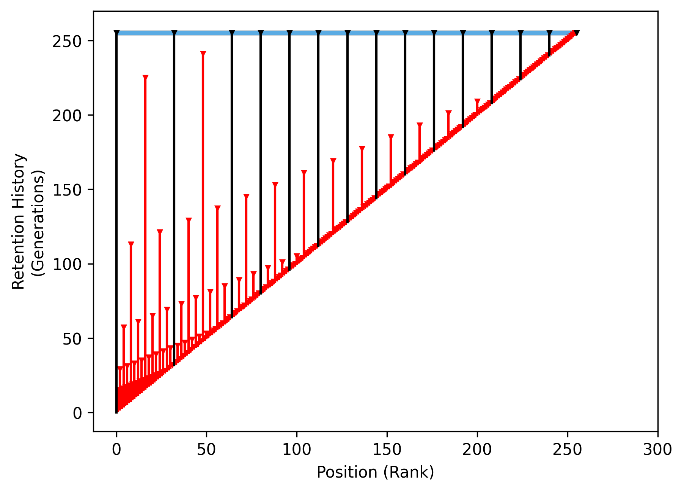](docs/assets/num_generations=256+policy=tapered-depth-proportional-resolution-stratum-retention-algorithm-resolution-7+viz=stratum-retention-dripplot+ext=.png) |

#### Dense Parameterization Detail
| Num Strata Retained                                                                                                                                                                                                                                                                                            | Absolute MRCA Uncertainty by Position                                                                                                                                                                                                                                                                                                                              | Relative MRCA Uncertainty by Position                                                                                                                                                                                                                                                                                         |
| -------------------------------------------------------------------------------------------------------------------------------------------------------------------------------------------------------------------------------------------------------------------------------------------------------------------------------- | ------------------------------------------------------------------------------------------------------------------------------------------------------------------------------------------------------------------------------------------------------------------------------------------------------------------------------------- | ------------------------------------------------------------------------------------------------------------------------------------------------------------------------------------------------------------------------------------------------------------------------------------------------------------------------------------- |
| [](docs/assets/num_generations=256+policy=tapered-depth-proportional-resolution-stratum-retention-algorithm-resolution-7+viz=strata-retained-num-lineplot+ext=.png) | [](docs/assets/num_generations=256+policy=tapered-depth-proportional-resolution-stratum-retention-algorithm-resolution-7+viz=mrca-uncertainty-absolute-barplot+ext=.png) | [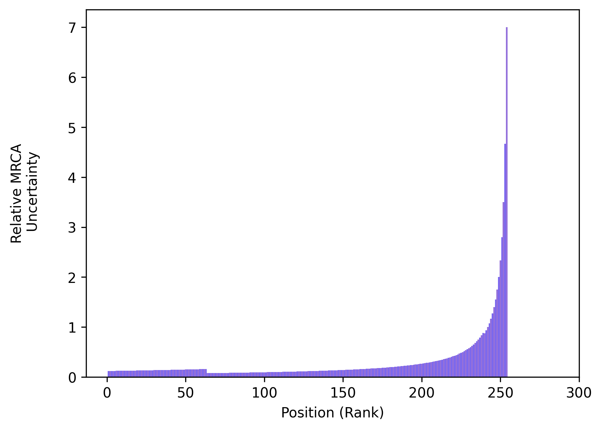](docs/assets/num_generations=256+policy=tapered-depth-proportional-resolution-stratum-retention-algorithm-resolution-7+viz=mrca-uncertainty-relative-barplot+ext=.png) |

### Fixed Resolution Algorithm

The fixed resolution algorithm permanently retains every `n`th stratum, giving it linear `O(n)` space complexity and uniform distribution of retained strata.

| Sparse Parameterization                                                                                                                                                                                                                                                                                     | Dense Parameterization                                                                                                                                                                                                                                                                                     |
| ----------------------------------------------------------------------------------------------------------------------------------------------------------------------------------------------------------------------------------------------------------------------------------------------------------- | ---------------------------------------------------------------------------------------------------------------------------------------------------------------------------------------------------------------------------------------------------------------------------------------------------------- |
| [](docs/assets/a=policy_panel_plot+num_generations=256+policy=fixed-resolution-stratum-retention-algorithm-resolution-128+ext=.gif)            | [](docs/assets/a=policy_panel_plot+num_generations=256+policy=fixed-resolution-stratum-retention-algorithm-resolution-32+ext=.gif)            |
| [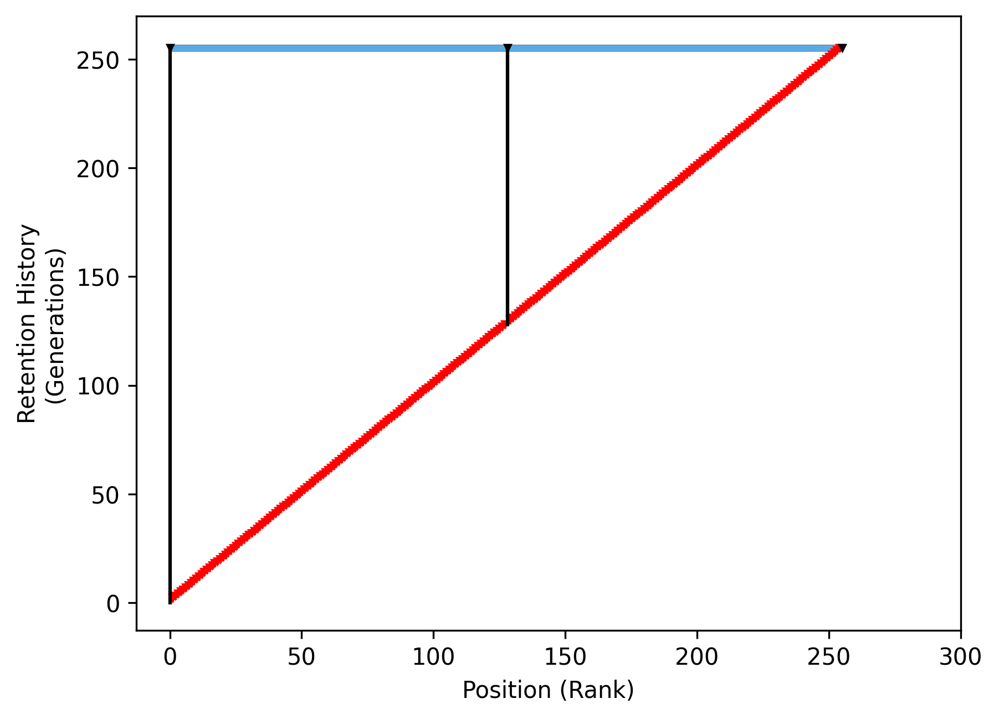](docs/assets/num_generations=256+policy=fixed-resolution-stratum-retention-algorithm-resolution-128+viz=stratum-retention-dripplot+ext=.png) | [](docs/assets/num_generations=256+policy=fixed-resolution-stratum-retention-algorithm-resolution-32+viz=stratum-retention-dripplot+ext=.png) |

#### Dense Parameterization Detail
| Num Strata Retained                                                                                                                                                                                                                                                                                            | Absolute MRCA Uncertainty by Position                                                                                                                                                                                                                                                                                                                              | Relative MRCA Uncertainty by Position                                                                                                                                                                                                                                                                                         |
| ------------------------------------------------------------------------------------------------------------------------------------------------------------------------------------------------------------------------------------------------------------------------------------------------------------ | ----------------------------------------------------------------------------------------------------------------------------------------------------------------------------------------------------------------------------------------------------------------------------------------------------------------- | ----------------------------------------------------------------------------------------------------------------------------------------------------------------------------------------------------------------------------------------------------------------------------------------------------------------- |
| [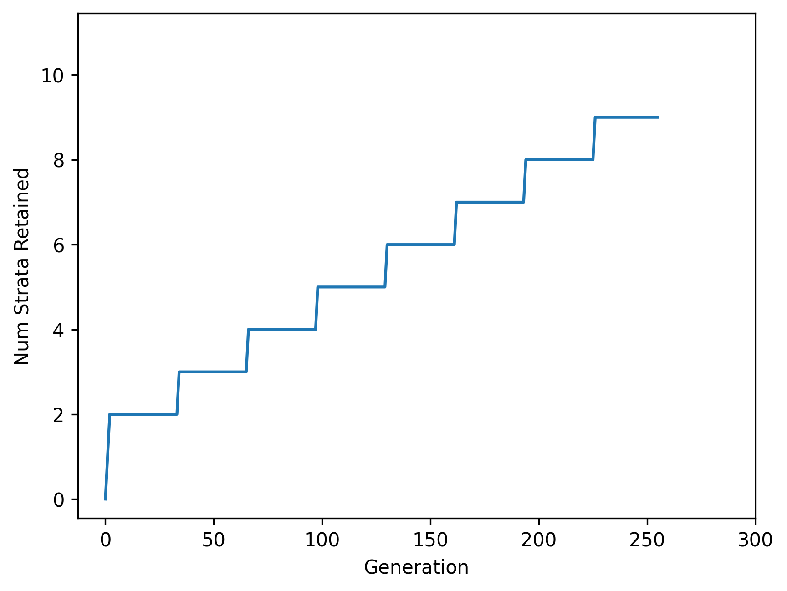](docs/assets/num_generations=256+policy=fixed-resolution-stratum-retention-algorithm-resolution-32+viz=strata-retained-num-lineplot+ext=.png) | [](docs/assets/num_generations=256+policy=fixed-resolution-stratum-retention-algorithm-resolution-32+viz=mrca-uncertainty-absolute-barplot+ext=.png) | [](docs/assets/num_generations=256+policy=fixed-resolution-stratum-retention-algorithm-resolution-32+viz=mrca-uncertainty-relative-barplot+ext=.png) |

### Geometric Sequence Nth Root Algorithm

The geometric sequence algorithm provides constant `O(1)` space complexity with recency-proportional distribution of retained strata.
To accomplish this, a fixed number `k` of fixed-size subcomponents track `k` waypoints exponentially spaced backward from the most-recent stratum (i.e., spaced corresponding to the roots `0/k`, `1/k`, `2/k`, ..., `k/k`).

| Sparse Parameterization                                                                                                                                                                                                                                                                                                         | Dense Parameterization                                                                                                                                                                                                                                                                                                             |
| ------------------------------------------------------------------------------------------------------------------------------------------------------------------------------------------------------------------------------------------------------------------------------------------------------------------------------- | ---------------------------------------------------------------------------------------------------------------------------------------------------------------------------------------------------------------------------------------------------------------------------------------------------------------------------------- |
| [](docs/assets/a=policy_panel_plot+num_generations=256+policy=nth-root-geometric-sequence-stratum-retention-algorithm-degree-6-interspersal-2+ext=.gif)            | [](docs/assets/a=policy_panel_plot+num_generations=256+policy=nth-root-geometric-sequence-stratum-retention-algorithm-degree-1024-interspersal-2+ext=.gif)            |
| [](docs/assets/num_generations=256+policy=nth-root-geometric-sequence-stratum-retention-algorithm-degree-6-interspersal-2+viz=stratum-retention-dripplot+ext=.png) | [](docs/assets/num_generations=256+policy=nth-root-geometric-sequence-stratum-retention-algorithm-degree-1024-interspersal-2+viz=stratum-retention-dripplot+ext=.png) |

#### Dense Parameterization Detail
| Num Strata Retained                                                                                                                                                                                                                                                                                            | Absolute MRCA Uncertainty by Position                                                                                                                                                                                                                                                                                                                              | Relative MRCA Uncertainty by Position                                                                                                                                                                                                                                                                                         |
| ------------------------------------------------------------------------------------------------------------------------------------------------------------------------------------------------------------------------------------------------------------------------------------------------------------------------------------ | ----------------------------------------------------------------------------------------------------------------------------------------------------------------------------------------------------------------------------------------------------------------------------------------------------------------------------------------- | ----------------------------------------------------------------------------------------------------------------------------------------------------------------------------------------------------------------------------------------------------------------------------------------------------------------------------------------- |
| [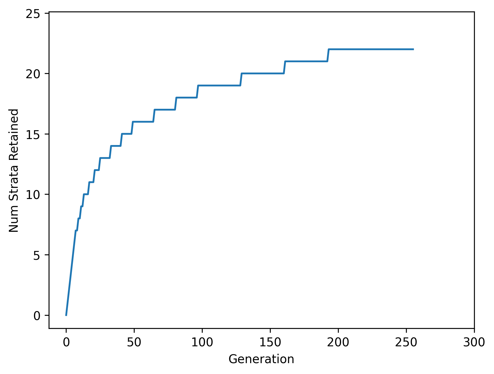](docs/assets/num_generations=256+policy=nth-root-geometric-sequence-stratum-retention-algorithm-degree-1024-interspersal-2+viz=strata-retained-num-lineplot+ext=.png) | [](docs/assets/num_generations=256+policy=nth-root-geometric-sequence-stratum-retention-algorithm-degree-1024-interspersal-2+viz=mrca-uncertainty-absolute-barplot+ext=.png) | [](docs/assets/num_generations=256+policy=nth-root-geometric-sequence-stratum-retention-algorithm-degree-1024-interspersal-2+viz=mrca-uncertainty-relative-barplot+ext=.png) |

### Tapered Geometric Sequence Nth Root Algorithm

The tapered geometric sequence nth root algorithm maintains exactly-constant size at its vanilla counterpart's upper bound instead of fluctuating below that bound.
It is more computationally expensive than the vanilla geometric sequence nth root algorithm.

| Sparse Parameterization                                                                                                                                                                                                                                                                                                                 | Dense Parameterization                                                                                                                                                                                                                                                                                                                  |
| --------------------------------------------------------------------------------------------------------------------------------------------------------------------------------------------------------------------------------------------------------------------------------------------------------------------------------------- | --------------------------------------------------------------------------------------------------------------------------------------------------------------------------------------------------------------------------------------------------------------------------------------------------------------------------------------- |
| [](docs/assets/a=policy_panel_plot+num_generations=256+policy=tapered-nth-root-geometric-sequence-stratum-retention-algorithm-degree-1-interspersal-2+ext=.gif)            | [](docs/assets/a=policy_panel_plot+num_generations=256+policy=tapered-nth-root-geometric-sequence-stratum-retention-algorithm-degree-4-interspersal-2+ext=.gif)            |
| [](docs/assets/num_generations=256+policy=tapered-nth-root-geometric-sequence-stratum-retention-algorithm-degree-1-interspersal-2+viz=stratum-retention-dripplot+ext=.png) | [](docs/assets/num_generations=256+policy=tapered-nth-root-geometric-sequence-stratum-retention-algorithm-degree-4-interspersal-2+viz=stratum-retention-dripplot+ext=.png) |

#### Dense Parameterization Detail
| Num Strata Retained                                                                                                                                                                                                                                                                                            | Absolute MRCA Uncertainty by Position                                                                                                                                                                                                                                                                                                                              | Relative MRCA Uncertainty by Position                                                                                                                                                                                                                                                                                         |
| ----------------------------------------------------------------------------------------------------------------------------------------------------------------------------------------------------------------------------------------------------------------------------------------------------------------------------------------- | ---------------------------------------------------------------------------------------------------------------------------------------------------------------------------------------------------------------------------------------------------------------------------------------------------------------------------------------------- | ---------------------------------------------------------------------------------------------------------------------------------------------------------------------------------------------------------------------------------------------------------------------------------------------------------------------------------------------- |
| [](docs/assets/num_generations=256+policy=tapered-nth-root-geometric-sequence-stratum-retention-algorithm-degree-4-interspersal-2+viz=strata-retained-num-lineplot+ext=.png) | [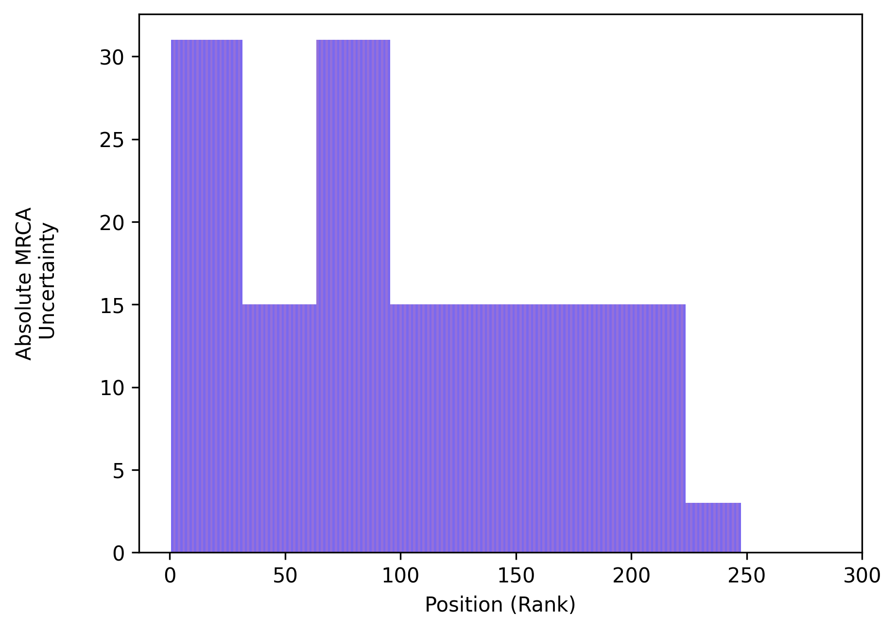](docs/assets/num_generations=256+policy=tapered-nth-root-geometric-sequence-stratum-retention-algorithm-degree-4-interspersal-2+viz=mrca-uncertainty-absolute-barplot+ext=.png) | [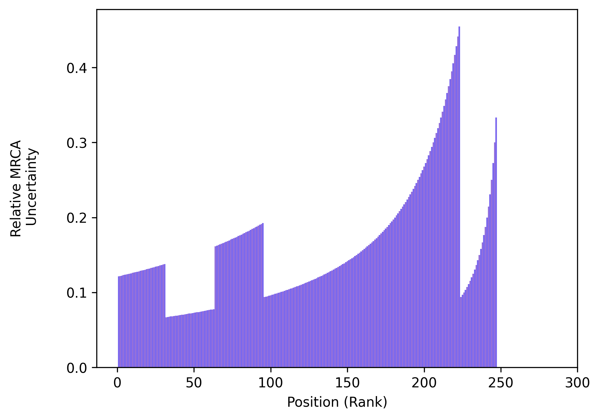](docs/assets/num_generations=256+policy=tapered-nth-root-geometric-sequence-stratum-retention-algorithm-degree-4-interspersal-2+viz=mrca-uncertainty-relative-barplot+ext=.png) |

### Recency Proportional Resolution Algorithm

The recency proportional resolution algorithm maintains relative MRCA estimation error below a constant bound.
It exhibits logarithmic `O(log(n))` space complexity.

| Sparse Parameterization                                                                                                                                                                                                                                                                                                  | Dense Parameterization                                                                                                                                                                                                                                                                                                   |
| ------------------------------------------------------------------------------------------------------------------------------------------------------------------------------------------------------------------------------------------------------------------------------------------------------------------------ | ------------------------------------------------------------------------------------------------------------------------------------------------------------------------------------------------------------------------------------------------------------------------------------------------------------------------ |
| [](docs/assets/a=policy_panel_plot+num_generations=256+policy=recency-proportional-resolution-stratum-retention-algorithm-resolution-0+ext=.gif)            | [](docs/assets/a=policy_panel_plot+num_generations=256+policy=recency-proportional-resolution-stratum-retention-algorithm-resolution-6+ext=.gif)             |
| [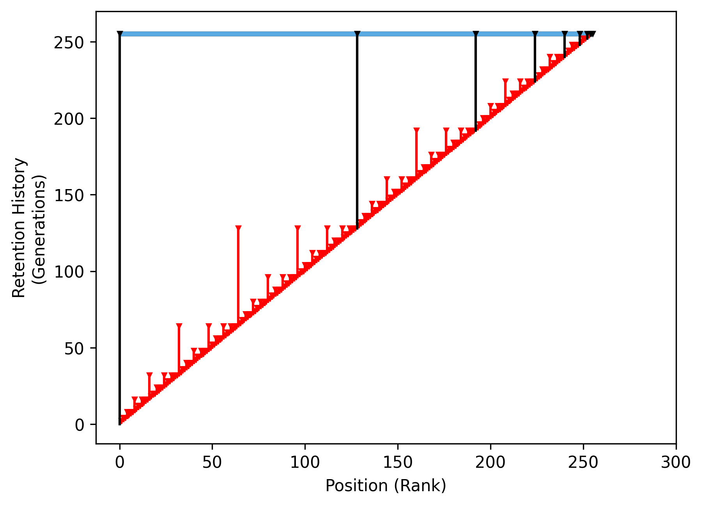](docs/assets/num_generations=256+policy=recency-proportional-resolution-stratum-retention-algorithm-resolution-0+viz=stratum-retention-dripplot+ext=.png) | [](docs/assets/num_generations=256+policy=recency-proportional-resolution-stratum-retention-algorithm-resolution-6+viz=stratum-retention-dripplot+ext=.png) |

#### Dense Parameterization Detail
| Num Strata Retained                                                                                                                                                                                                                                                                                            | Absolute MRCA Uncertainty by Position                                                                                                                                                                                                                                                                                                                              | Relative MRCA Uncertainty by Position                                                                                                                                                                                                                                                                                         |
| -------------------------------------------------------------------------------------------------------------------------------------------------------------------------------------------------------------------------------------------------------------------------------------------------------------------------- | ------------------------------------------------------------------------------------------------------------------------------------------------------------------------------------------------------------------------------------------------------------------------------------------------------------------------------- | ------------------------------------------------------------------------------------------------------------------------------------------------------------------------------------------------------------------------------------------------------------------------------------------------------------------------------- |
| [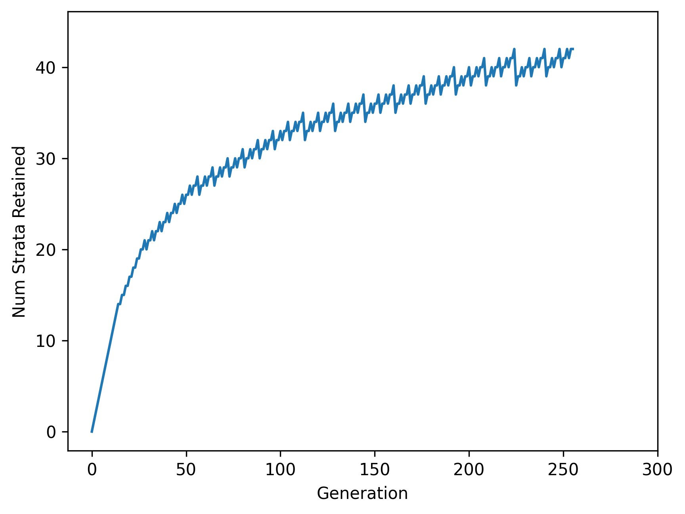](docs/assets/num_generations=256+policy=recency-proportional-resolution-stratum-retention-algorithm-resolution-6+viz=strata-retained-num-lineplot+ext=.png) | [](docs/assets/num_generations=256+policy=recency-proportional-resolution-stratum-retention-algorithm-resolution-6+viz=mrca-uncertainty-absolute-barplot+ext=.png) | [](docs/assets/num_generations=256+policy=recency-proportional-resolution-stratum-retention-algorithm-resolution-6+viz=mrca-uncertainty-relative-barplot+ext=.png) |

### Curbed Recency Proportional Resolution Algorithm

The curbed recency-proportional resolution algorithm eagerly utilize fixed stratum storage capacity to minimize recency-proportional MRCA uncertainty.

This strategy provides the finest-possible recency-proportional granularity within parameterized space constraint.
Resolution degrades gracefully as deposition history grows.

This algorithm is similar to the geometric sequence nth root algorithm in guaranteeing constant space complexity with recency-proportional MRCA uncertainty.
However, this curbed recency-proportional algorithm makes fuller (i.e., more aggressive) use of available space during early depositions.

In this way, it is similar to the tapered geometric sequence nth root algorithm during early depositions.
The tapered nth root algorithm makes fullest use of fixed available space.
In fact, it perfectly fills available space.
However, the curbed recency-proportional algorithm's space use is more effective at early time points --- it better minimizes recency-proportional MRCA uncertainty than the curbed algorithm.

| Sparse Parameterization                                                                                                                                                                                                                                                                                                  | Dense Parameterization                                                                                                                                                                                                                                                                                                   |
| ------------------------------------------------------------------------------------------------------------------------------------------------------------------------------------------------------------------------------------------------------------------------------------------------------------------------ | ------------------------------------------------------------------------------------------------------------------------------------------------------------------------------------------------------------------------------------------------------------------------------------------------------------------------ |
| [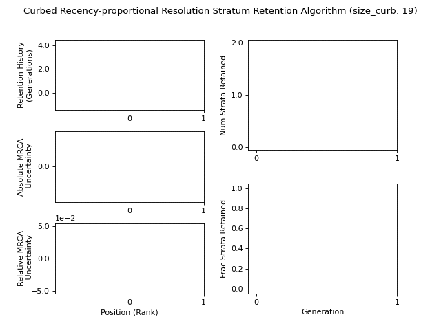](docs/assets/a=policy_panel_plot+num_generations=256+policy=curbed-recency-proportional-resolution-stratum-retention-algorithm-size-curb-19+ext=.gif)            | [](docs/assets/a=policy_panel_plot+num_generations=256+policy=curbed-recency-proportional-resolution-stratum-retention-algorithm-size-curb-79+ext=.gif)             |
| [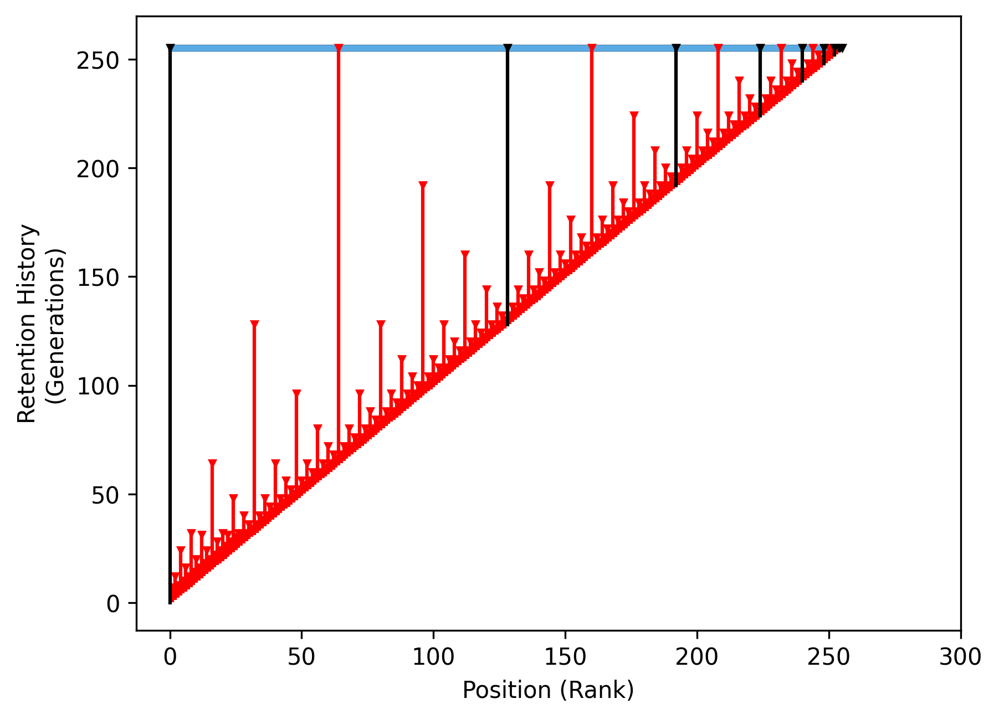](docs/assets/num_generations=256+policy=curbed-recency-proportional-resolution-stratum-retention-algorithm-size-curb-19+viz=stratum-retention-dripplot+ext=.png) | [](docs/assets/num_generations=256+policy=curbed-recency-proportional-resolution-stratum-retention-algorithm-size-curb-79+viz=stratum-retention-dripplot+ext=.png) |

#### Dense Parameterization Detail
| Num Strata Retained                                                                                                                                                                                                                                                                                            | Absolute MRCA Uncertainty by Position                                                                                                                                                                                                                                                                                                                              | Relative MRCA Uncertainty by Position                                                                                                                                                                                                                                                                                         |
| -------------------------------------------------------------------------------------------------------------------------------------------------------------------------------------------------------------------------------------------------------------------------------------------------------------------------- | ------------------------------------------------------------------------------------------------------------------------------------------------------------------------------------------------------------------------------------------------------------------------------------------------------------------------------- | ------------------------------------------------------------------------------------------------------------------------------------------------------------------------------------------------------------------------------------------------------------------------------------------------------------------------------- |
| [](docs/assets/num_generations=256+policy=curbed-recency-proportional-resolution-stratum-retention-algorithm-size-curb-79+viz=strata-retained-num-lineplot+ext=.png) | [](docs/assets/num_generations=256+policy=curbed-recency-proportional-resolution-stratum-retention-algorithm-size-curb-79+viz=mrca-uncertainty-absolute-barplot+ext=.png) | [](docs/assets/num_generations=256+policy=curbed-recency-proportional-resolution-stratum-retention-algorithm-size-curb-79+viz=mrca-uncertainty-relative-barplot+ext=.png) |

This policy works by splicing together successively-sparser
`recency_proportional_resolution_algo` paramaterizations then a
permanently fixed parameterization of the `geometric_seq_nth root` algorithm.
Sparsification occurs when upper bound space use increases to exceed the fixed-size available capacity.
For a very sparse paramaterization with a size cap of eight strata, shown below, the transition to `geometric_seq_nth_root_ago` can be seen at generation 129.

| Very Sparse Parameterization | |
|------------------------------|-|
| [](docs/assets/a=policy_panel_plot+num_generations=256+policy=curbed-recency-proportional-resolution-stratum-retention-algorithm-size-curb-9+ext=.gif) |  |

#### Very Sparse Parameterization Detail
| Num Strata Retained                                                                                                                                                                                                                                                                                            | Absolute MRCA Uncertainty by Position                                                                                                                                                                                                                                                                                                                              | Relative MRCA Uncertainty by Position                                                                                                                                                                                                                                                                                         |
| -------------------------------------------------------------------------------------------------------------------------------------------------------------------------------------------------------------------------------------------------------------------------------------------------------------------------- | ------------------------------------------------------------------------------------------------------------------------------------------------------------------------------------------------------------------------------------------------------------------------------------------------------------------------------- | ------------------------------------------------------------------------------------------------------------------------------------------------------------------------------------------------------------------------------------------------------------------------------------------------------------------------------- |
| [](docs/assets/num_generations=256+policy=curbed-recency-proportional-resolution-stratum-retention-algorithm-size-curb-8+viz=strata-retained-num-lineplot+ext=.png) | [](docs/assets/num_generations=256+policy=curbed-recency-proportional-resolution-stratum-retention-algorithm-size-curb-8+viz=mrca-uncertainty-absolute-barplot+ext=.png) | [](docs/assets/num_generations=256+policy=curbed-recency-proportional-resolution-stratum-retention-algorithm-size-curb-8+viz=mrca-uncertainty-relative-barplot+ext=.png) |

### Other Algorithms

These stratum retention algorithms are less likely of interest to end users, included in the library primarily for testing and design validation, but are available nonetheless.

- nominal resolution policy
- perfect resolution policy
- pseudostochastic policy
- stochastic policy

### Custom Algorithm Design

Custom stratum retention algorithms can easily be substituted for supplied algorithms without performing any modifications to library code.
To start, you'll most likely want to copy an existing algorithm from `hstrat/stratum_retention_strategy/stratum_retention_algorithms` to use as an API scaffold.

If writing a custom stratum retention algorithm, you will need to consider

1. Prune sequencing.

   When you discard a stratum now, it won't be available later.
   If you need a stratum at a particular time point, you must be able to guarantee it hasn't already been discarded at any prior time point.

2. Column composition across intermediate generations.

   For many use cases, resolution and column size guarantees will need to hold at all generations because the number of generations elapsed at the end of an experiment is not known _a priori_ or the option of continuing the experiment with evolved genomes is desired.

3. Tractability of computing the deposit generations of retained strata at an arbitrary generation.

   If this set of generations can be computed efficiently, then an efficient reverse mapping from column array index to deposition generation can be attained.
   Such a mapping enables deposition generation to be omitted from strata, potentially yielding a 50%+ space savings (depending on the differentia bit width used).

## Algorithm Parameterizers

Stratum retention algorithms can be automatically parameterized for desired properties.
For example, you may want to produce a policy from a particular algorithm that retains at most 100 strata at generation 1 million.

Two components are required to perform a parameterization.

The first, an "evaluator" controls which policy property is being parameterized for.
Available options are

- `MrcaUncertaintyAbsExactEvaluator`
- `MrcaUncertaintyAbsUpperBoundEvaluator`
- `MrcaUncertaintyRelExactEvaluator`
- `MrcaUncertaintyRelUpperBoundEvaluator`
- `NumStrataRetainedExactEvaluator`
- `NumStrataRetainedUpperBoundEvaluator`

The second, a "parameterizer" controls whether the policy property should be paramaterized to be greater than, equal, or less than equal a target value.
Available options are

- `PropertyAtMostParameterizer`
- `PropertyAtLeastParameterizer`
- `PropertyExactlyParameterizer`

The evaluator should be provided as an argument to parameterizer, which should in turn be provided as an argument to the algorithm's `Policy` initializer.

```python3
stratum_retention_policy = hstrat.geom_seq_nth_root_tapered_algo.Policy(
    parameterizer=hstrat.PropertyAtMostParameterizer(
        target_value=127,
        policy_evaluator \
            =hstrat.MrcaUncertaintyAbsExactEvaluator(
                at_num_strata_deposited=256,
                at_rank=0,
        ),
    ),
)
```

## References

<a id="moreno2022genome" href=https://doi.org/10.1162/isal_a_00550>
Matthew Andres Moreno, Emily Dolson, Charles Ofria; July 18–22, 2022. "Hereditary Stratigraphy: Genome Annotations to Enable Phylogenetic Inference over Distributed Populations." Proceedings of the ALIFE 2022: The 2022 Conference on Artificial Life. ALIFE 2022: The 2022 Conference on Artificial Life. Online. (pp. 64). ASME.
</a>

## Credits

This package was created with Cookiecutter and the `audreyr/cookiecutter-pypackage` project template.

## hcat


